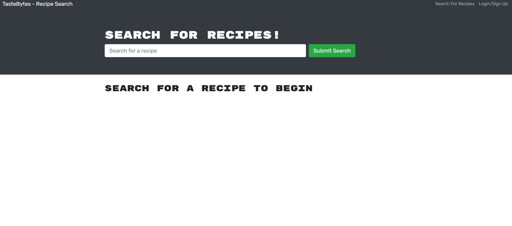
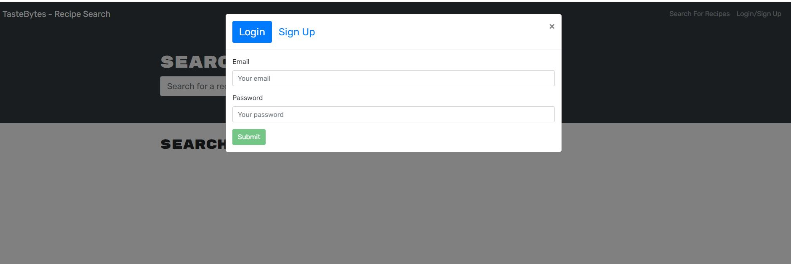
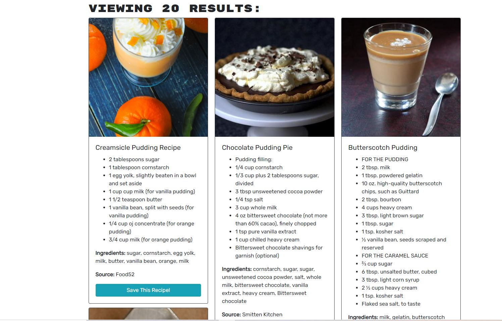
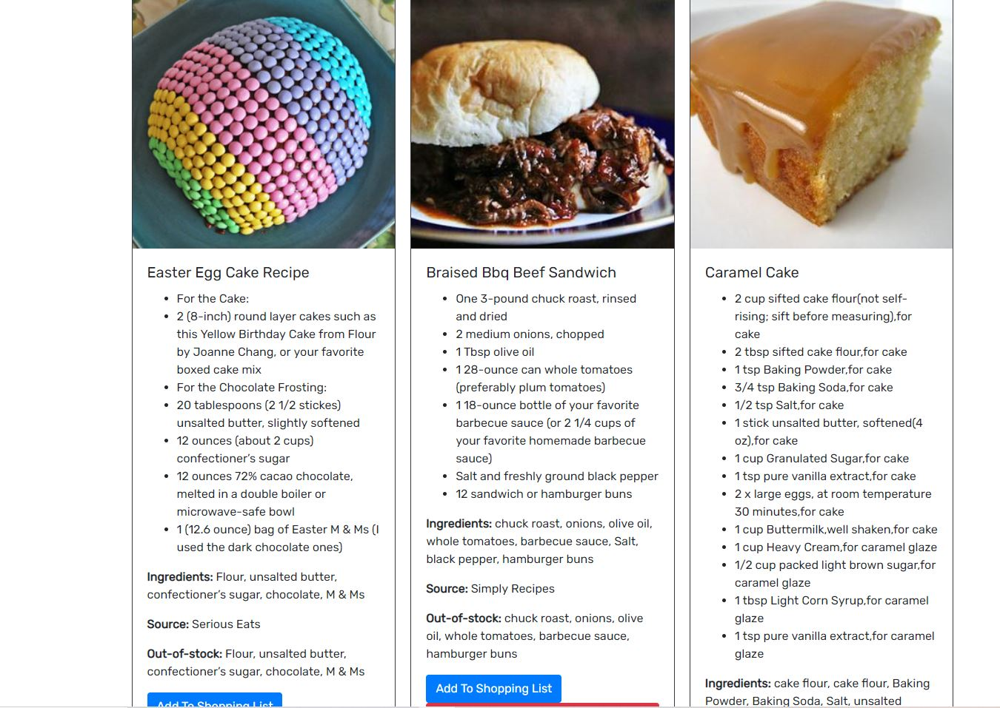
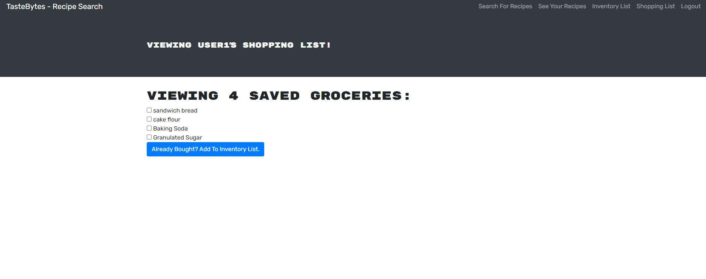
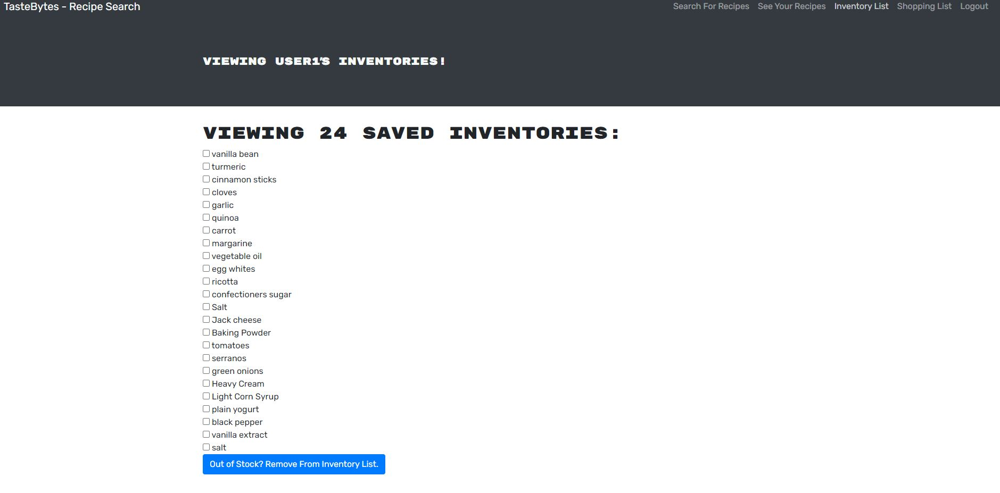

## TasteBytes

## Description
   Taste Bytes is a web application where you can search for popular recipes, plan meal preparation for the coming week, identify out of stock groceries for shopping and manage the kitchen inventory.

## Motivation
    Upfront planning on next week meals will help a big family (with kids) enjoy variety in their meals and will save a lot of time with intelligent shopping and inventory management.

## User Story
  As a Busy Mom, I WANT an intelligent web application that will assist with meal planning and kitchen inventory management, SO THAT I can search for popular recipes, plan meal preparation for the coming week, identify out of stock groceries for shopping and manage the kitchen inventory.

## Table of Contents

- [Installation](#installation)

- [Technologies](#technologies)

- [Usage](#usage)

- [License](#license)

- [Deployed Link](#deployed)

## Technologies

    - HTML
    - CSS
    - Bootstrap
    - JavaScript
    - Node.js
    - MongoDB
    - Mongoose
    - Express.js
    - REACT
    - GraphQL
    - Apollo Server
    - Json Web Tokens
    - Bcrypt
    - Redux
    - React-Redux

## Installation

To install necessary dependencies, run the following command:

   * npm install

## Usage

Run `npm run develop` command in the main directory to start the server after installing dependencies. Open a browser and go to localhost:3000

## License

This project is licensed under the MIT license

## Deployed

Live URL: https://salty-lake-29216.herokuapp.com/ 

GitHub Link: https://github.com/jyothybaby/TasteBytes

## Contributors
    Jyothy V Baby 
